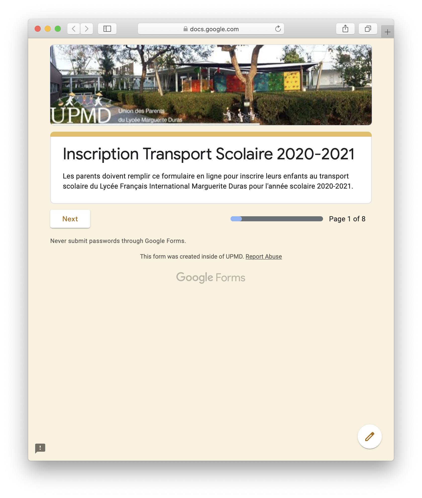
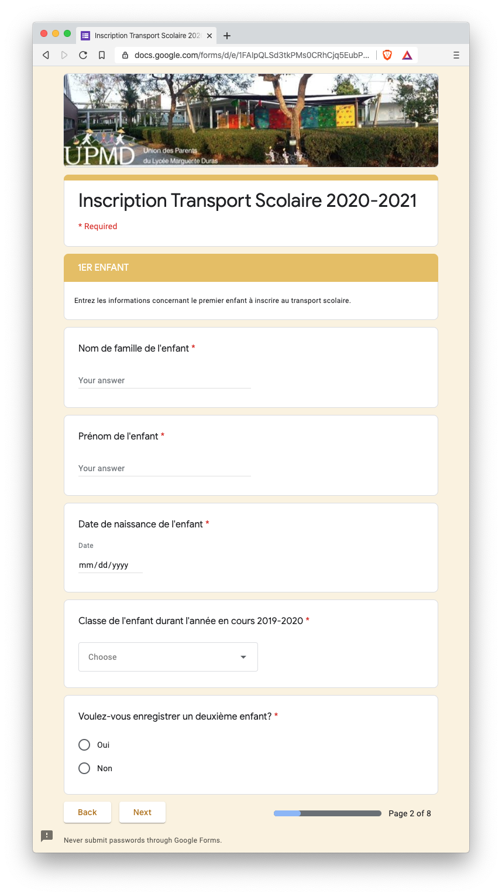
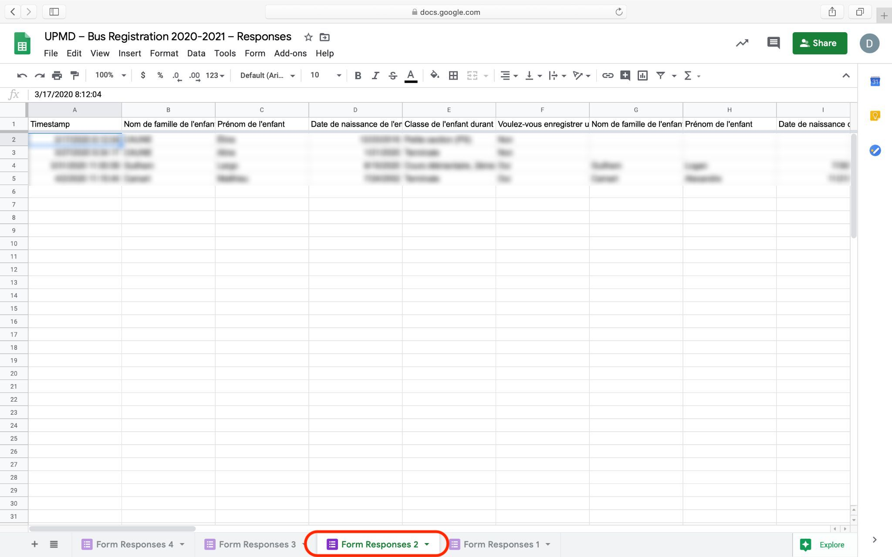

# UPMD School Bus Registration Aggregator

L'[Union des Parents d'Élèves](https://www.upmd.fr) du [Lycée Français International Marguerite Duras](http://lfiduras.com) met en place un formulaire en ligne permettant aux parents d'enregistrer leur(s) enfant(s) au transport scolaire.

|                                               |                                               |
| --------------------------------------------- | --------------------------------------------- |
|  |  |

Ce formulaire en ligne est décliné en 4 langues :

- [Anglais](https://forms.gle/BPkmA9X2dGeuJmTX6)
- [Coréen](https://forms.gle/FE9iAGEfq4ksRCrY7)
- [Français](https://forms.gle/NH9g2W8xEXx3kBgd9)
- [Vietnamien](https://forms.gle/hSr5wPwrUGXqVuwr5)

L'UPMD utilise 4 Google Forms pour implémenter ces 4 formulaires dynamiques. Ces 4 formulaires sont configurés pour enregistrer les réponses des parents dans un document Google Sheets. Cependant, chaque formulaire Google Forms enregistre les réponses dans une feuille séparée du document Google Sheets.

Le script en ligne de commande (CLI) `aggregate_bus_registration` permet d'aggréger les réponses aux formulaires en un seul jeu de données.

## Google Credentials

https://developers.google.com/sheets/api/quickstart/python

https://developers.google.com/sheets/api/guides/authorizing#APIKey

https://console.developers.google.com/projectselector2/apis/credentials?pli=1&supportedpurview=project
